# 🧠 ML Play

<p align="center">
  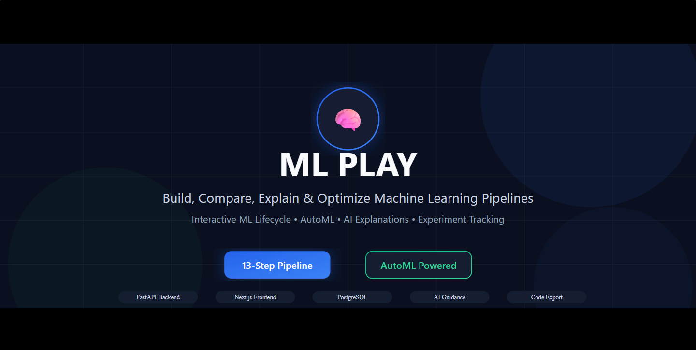
</p>

<div align="center">

### Build, Compare, Explain & Optimize Machine Learning Pipelines

### Without Writing Code

Interactive ML Lifecycle • AutoML • AI Explanations • Experiment Tracking • Code Export

[Live Demo](https://ml-play-frontend.vercel.app) • [API Docs](https://backend-production-dbc5.up.railway.app/docs)

</div>

---

# 🎥 Product Walkthrough

▶ **Demo Video (Click to Watch)**

[ML Play Demo](./docs/ML-Play.mp4)

---

# 🚀 Why ML Play?

Machine Learning workflows are often fragmented across notebooks, scripts, visualization tools, experimentation platforms, and documentation.

ML Play brings the entire machine learning lifecycle into a single interactive platform.

Whether you're a student learning machine learning, a data scientist experimenting with models, or a developer exploring datasets, ML Play provides a visual environment to:

* Upload and analyze datasets
* Apply preprocessing techniques
* Train and tune models
* Compare experiments
* Understand decisions with AI-powered explanations
* Export production-ready Python code

---

# ✨ Key Features

✅ Data Profiling

✅ Exploratory Data Analysis (EDA)

✅ Missing Value Engineering

✅ Outlier Treatment

✅ Feature Engineering

✅ Feature Selection

✅ Scaling & Normalization

✅ Model Training

✅ Hyperparameter Optimization

✅ AutoML

✅ AI-Powered Explanations

✅ Experiment Tracking

✅ Python Code Export

---

# 🔄 ML Lifecycle

```mermaid
flowchart LR

A[Dataset Upload]
--> B[Data Profiling]

B --> C[EDA]

C --> D[Missing Values]

D --> E[Outlier Treatment]

E --> F[Feature Engineering]

F --> G[Encoding]

G --> H[Feature Selection]

H --> I[Scaling]

I --> J[Model Training]

J --> K[Hyperparameter Tuning]

K --> L[Experiment Comparison]

L --> M[AI Explanation]

M --> N[Code Export]
```

---

# 🏗 Architecture

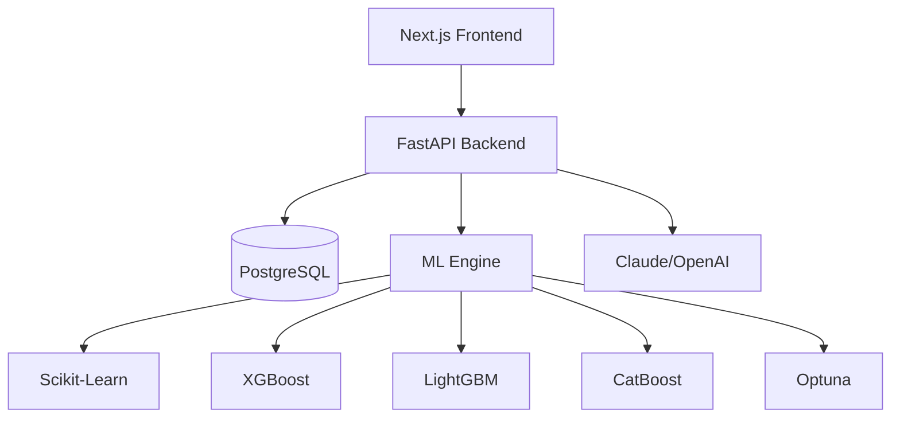

---

# 📸 Screenshots

## 🏠 Home Page

> Replace with your landing page screenshot.

<p align="center">
  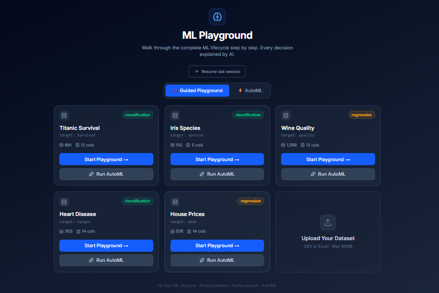
</p>

---

## 📊 Data Profiling

> Dataset overview, missing value analysis, and feature statistics.

<p align="center">
  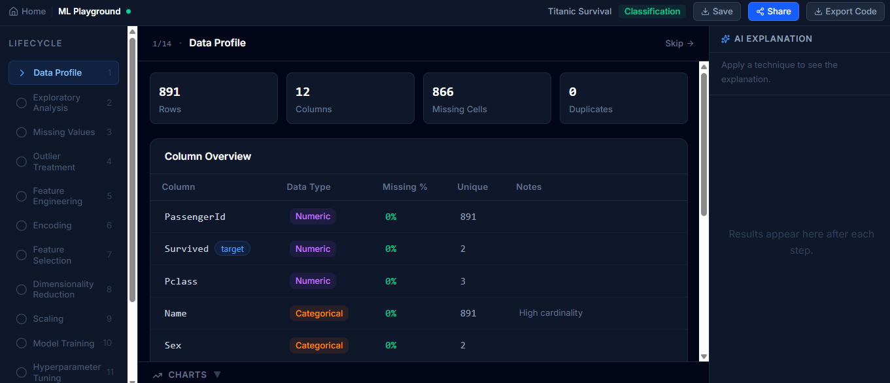
</p>

---

## 🔍 Exploratory Data Analysis

> Interactive visualizations and dataset exploration.

<p align="center">
  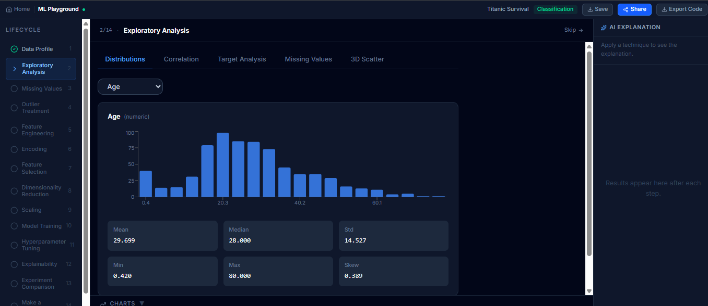
</p>

---

## 🧩 Missing Value Engineering

> Compare multiple imputation techniques before applying them.

<p align="center">
  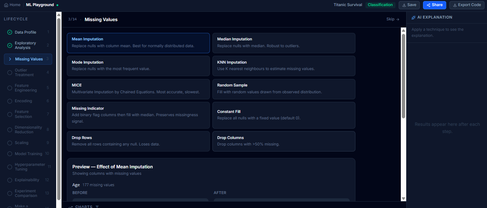
</p>

---

## 👀 Transformation Preview

> Preview dataset changes before execution.

<p align="center">
  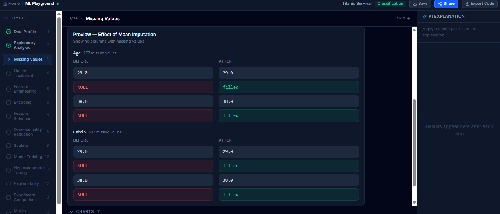
</p>

---

## 🤖 AI-Powered Explanations

> Understand what changed, why it changed, and recommended next steps.

<p align="center">
  
</p>

---

## 🎯 Model Training

> Train machine learning models with configurable hyperparameters.

<p align="center">
  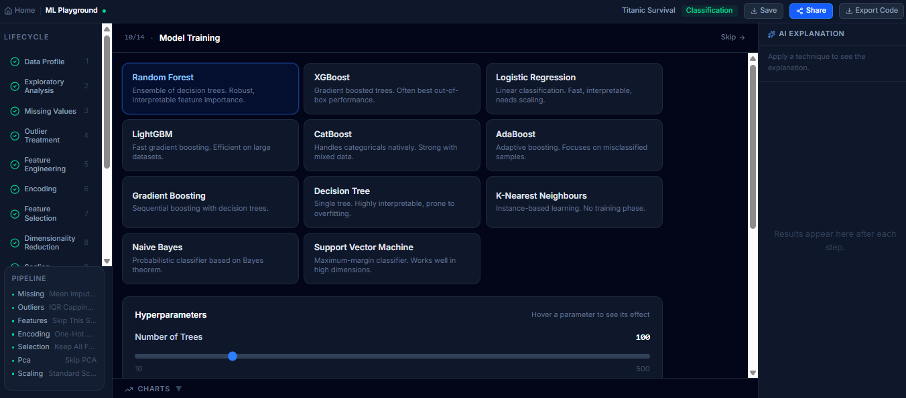
</p>

---

## ⚙ Hyperparameter Optimization

> Fine-tune models using interactive controls.

<p align="center">
  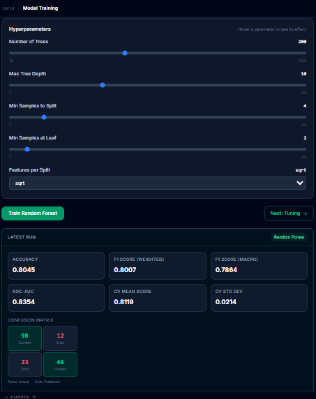
</p>

---

## 🏆 Experiment Comparison

> Compare multiple model runs side-by-side.

<p align="center">
  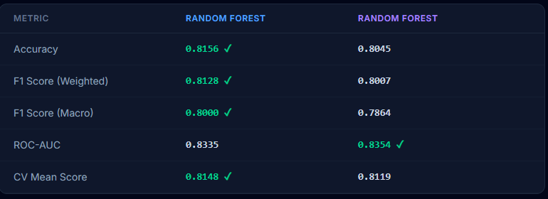
</p>

---

## ⚡ AutoML

> One-click optimization using automated model selection and tuning.

<p align="center">
  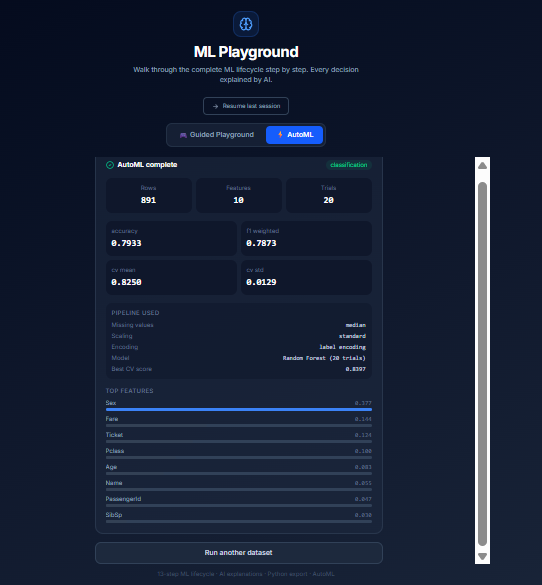
</p>

---

# 💻 Tech Stack

### Frontend

* Next.js
* TypeScript
* Tailwind CSS
* Recharts

### Backend

* FastAPI
* Python
* SQLAlchemy
* Alembic

### Database

* PostgreSQL

### Machine Learning

* Scikit-Learn
* XGBoost
* LightGBM
* CatBoost
* Optuna

### AI Integration

* Anthropic Claude
* OpenAI

### Deployment

* Vercel
* Railway

---

# 📂 Project Structure

```text
ML-Play
│
├── frontend
│
├── backend
│
├── docs
│   |-- screenshots
|   |-- assets
│   |-- ML-Play.mp4
│
└── README.md
```

---

# 🚀 Quick Start

## Clone Repository

```bash
git clone https://github.com/Abhay-SKulkarni123/ML-Play.git

cd ML-Play
```

## Backend Setup

```bash
cd backend

python -m venv venv

pip install -r requirements.txt

alembic upgrade head

uvicorn app.main:app --reload
```

## Frontend Setup

```bash
cd frontend

npm install

npm run dev
```

---

# 🌟 What I Learned

Building ML Play provided hands-on experience with:

* End-to-End Product Development
* Backend Architecture
* Machine Learning Pipelines
* AutoML Workflows
* AI Integration
* Experiment Tracking
* Database Design
* Production Deployment

---

# 🔗 Links

### Live Application

https://ml-play-frontend.vercel.app

### Backend API

https://backend-production-dbc5.up.railway.app/docs

### GitHub Repository

https://github.com/Abhay-SKulkarni123/ML-Play

---

<div align="center">
Built by -> A S K

</div>
